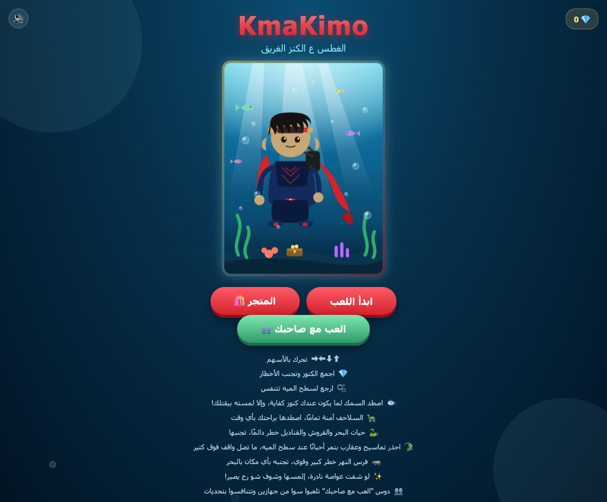
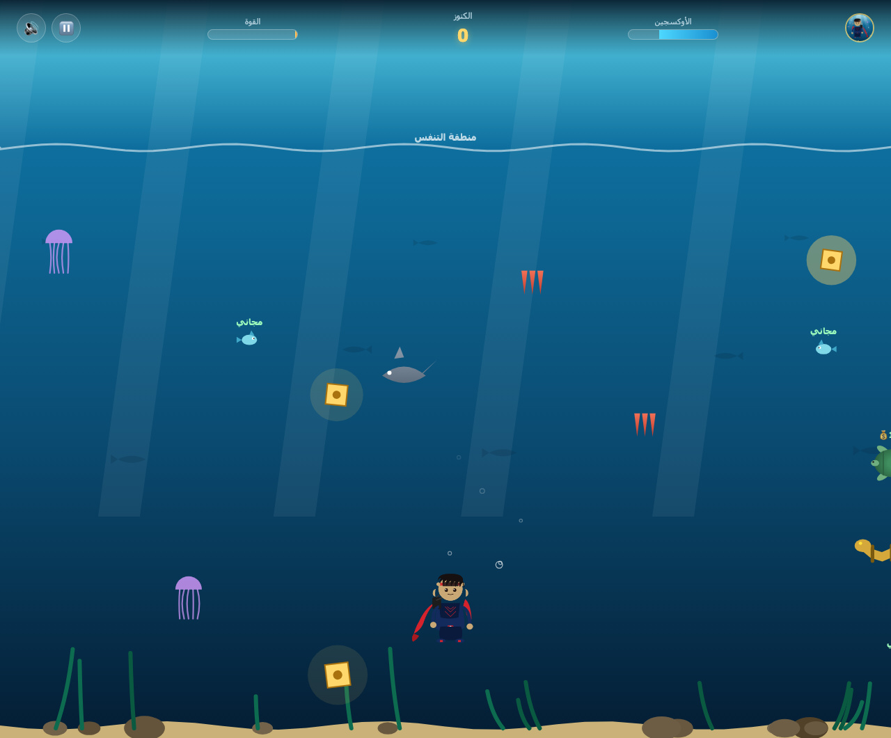
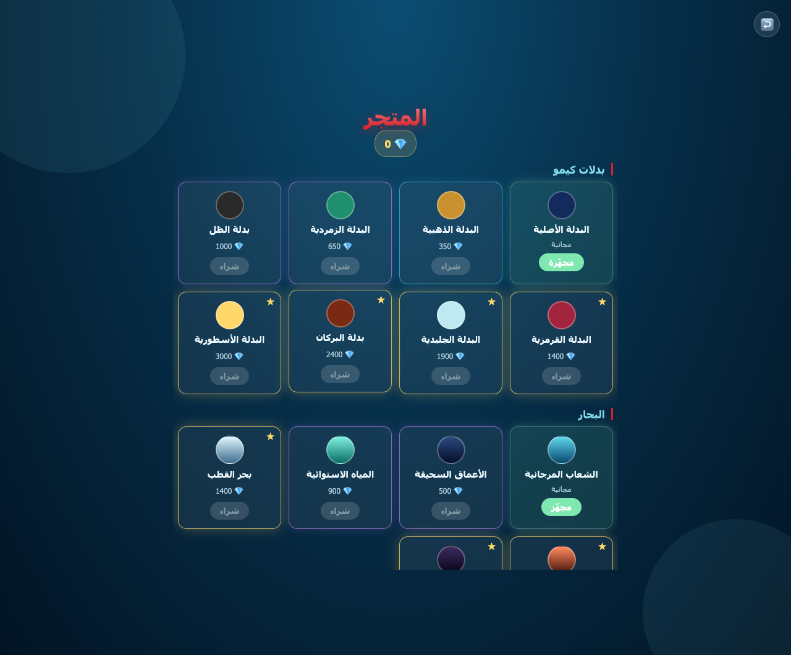
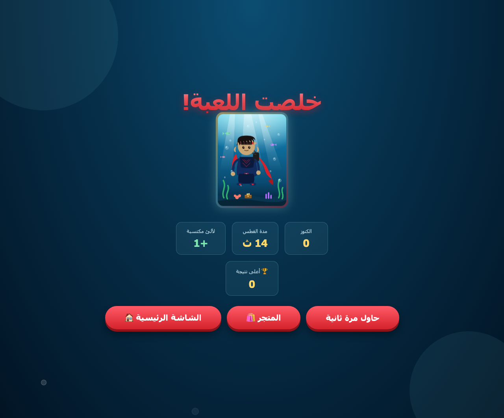
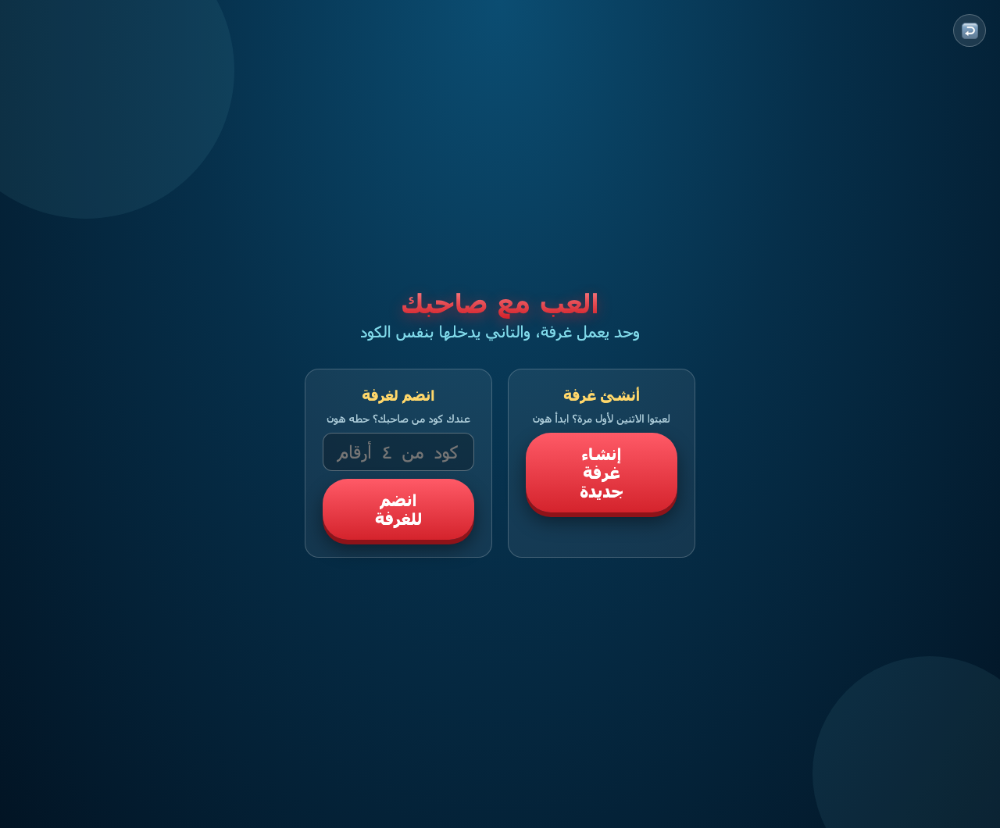
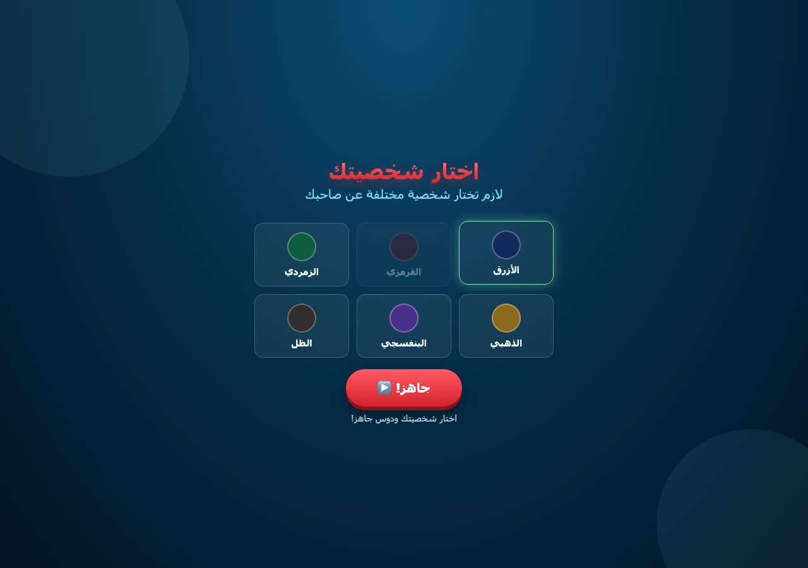
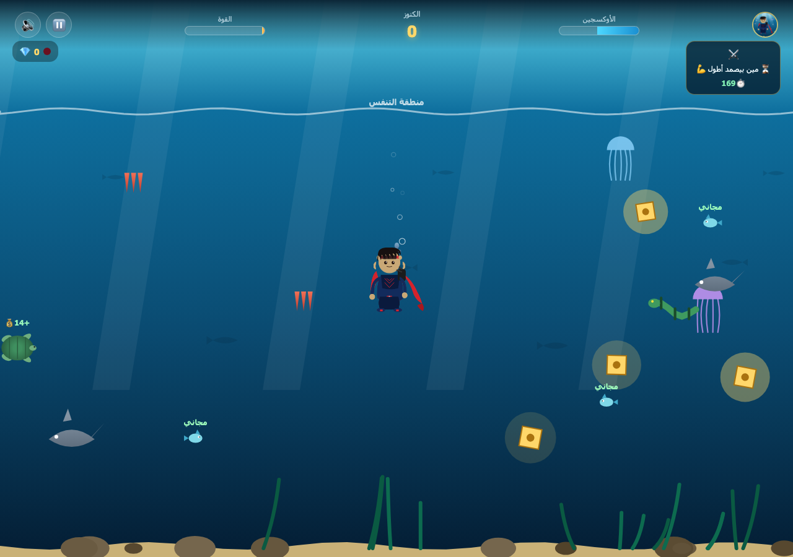
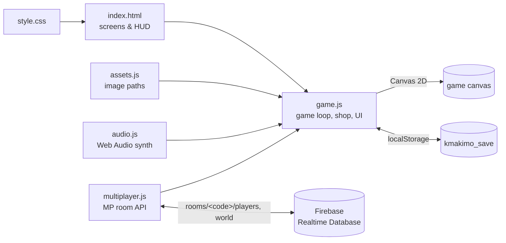

# 🤿 KmaKimo — Treasure Dive

**An Arabic underwater arcade game: dive for sunken treasure, catch fish, dodge sea monsters, and challenge a friend online.**

[](https://saadosama10.github.io/kmakimo-treasure-dive/)


> 🌐 **Language note:** the game's interface is in **Arabic (RTL, Levantine dialect)**. A short English summary of how to play is below.

## Play

👉 **https://saadosama10.github.io/kmakimo-treasure-dive/**

Or run it locally (see [How to Run](#how-to-run)).

## Screenshots

| Menu | Gameplay |
|---|---|
|  |  |
| **Shop** | **Game over** |
|  |  |

| Multiplayer menu | Character select | Online match (challenge banner top-right) |
|---|---|---|
|  |  |  |

## Overview

KmaKimo ("الغطس ع الكنز الغريق" — *diving for the sunken treasure*) is a single-page browser game built with plain HTML, CSS and JavaScript on a Canvas 2D renderer. You control a diver with limited oxygen: collect treasure, come up to the surface to breathe, and avoid or catch the creatures of the sea. Treasure and best score are earned across runs, and pearls collected can be spent in a shop on suits, seas and permanent upgrades. Two players can also race each other in real time through a shared room code.

## Gameplay (English summary)

- **Goal:** collect as many treasures as you can before your oxygen runs out or you hit a hazard.
- **Oxygen:** it drains underwater and refills at the surface ("breathing zone").
- **Fish:** you can only catch a fish once you have collected enough treasure for its size — touch a bigger fish too early and you die. Each fish type has a required treasure count and a reward.
- **Turtles:** always safe to catch.
- **Hazards:** jellyfish, sharks, sea snakes, coral, hippos, and crocodiles and scorpions that pass near the surface.
- **Power-ups:** shield and speed boost (temporary).
- **Rare submarine:** a friendly submarine that appears now and then and teleports you to a different sea.
- **Pearls & shop:** each run earns pearls, spent on suit skins, sea themes and permanent upgrades.
- **Multiplayer:** one player creates a room and shares its 4-digit code; the other joins. Each picks a different character, then you play rounds of challenges against each other.

### Controls

| Input | Action |
|---|---|
| Arrow keys (⬆ ⬇ ⬅ ➡) | Swim |
| On-screen arrow buttons | Swim (shown on touch devices) |
| ⏸ button | Pause |
| 🔊 button | Mute / unmute |
| ⛶ button | Fullscreen (touch devices) |

## Features

- **Oxygen and power system** — oxygen bar plus a power bar that fills over the run and gradually raises your speed and maximum oxygen.
- **10 catchable fish types** with treasure requirements and rewards, plus 2 turtle types.
- **Hazards:** jellyfish, sharks, snakes, coral, hippos, crocodiles, scorpions, plus oversized boss sharks.
- **Shield and boost power-ups**, and a rare submarine that switches the sea.
- **Shop** with **8 suits**, **6 seas** and **6 permanent upgrades** (oxygen tank, speed, treasure magnet, shields, oxygen regeneration, fisher's luck).
- **Local progress** — pearls, purchases, upgrades and best score are saved in the browser (`localStorage`).
- **Online two-player mode** via room codes, 6 colour characters and 9 challenge types (first to collect coins / catch fish / catch a rare fish / rescue turtles / grab a big treasure, and timed races for survival, coins, fish and depth).
- **All audio is synthesized** at runtime with the Web Audio API — no audio files.
- **Responsive** — landscape prompt and touch controls for phones.

## Architecture



`game.js` owns the game state and rendering; `multiplayer.js` wraps Firebase behind a small API (`createRoom`, `joinRoom`, `startBroadcasting`, `onOpponentChange`, `onWorldChange`, …) so the game code never touches Firebase directly.

## Project Structure

```
.
├── index.html            # All screens (menu, shop, multiplayer, game, pause, end)
├── style.css             # Styling (RTL, responsive)
├── game.js               # Game loop, entities, shop, challenges, rendering
├── audio.js              # Procedural sound effects and music (Web Audio)
├── multiplayer.js        # Firebase Realtime Database room layer
├── assets.js             # Image path manifest
├── assets/               # Player sprite, 6 character sprites, hero illustration
├── tools/hero.svg        # Source of the original hero illustration
├── database.rules.json   # Firebase Realtime Database security rules
├── firebase.json         # Firebase CLI config
├── .firebaserc           # Firebase project alias
└── docs/screenshots/     # README screenshots
```

## How to Run

No build step or dependencies. Serve the folder over HTTP:

```bash
git clone https://github.com/SaadOsama10/kmakimo-treasure-dive.git
cd kmakimo-treasure-dive
python3 -m http.server 8000
# open http://localhost:8000
```

The Firebase SDK is loaded from Google's CDN, and multiplayer needs an internet connection.

### Firebase notes

`multiplayer.js` contains the project's Firebase **web config**. This is public by design — it identifies the project and is not a secret. Access is enforced by the database rules in [`database.rules.json`](database.rules.json): only paths under `rooms/<4-digit code>` can be read or written. To use your own backend, replace the config in `multiplayer.js` and deploy the rules with `firebase deploy --only database`.

## Known Limitations

- The interface is **Arabic only** (no language switcher).
- Controls are arrow keys or on-screen buttons; there is no WASD or gamepad support.
- Multiplayer is **unauthenticated**: anyone who knows or guesses a 4-digit room code can join an open room or write to it, and rooms support at most 2 players. There is no cheat protection — game state is client-side.
- Rooms are not automatically cleaned up server-side.
- Progress is stored per browser; clearing site data resets it.

## Author

**Saed O S Radi** — Software Engineering student, FSMVU · [@SaadOsama10](https://github.com/SaadOsama10)
